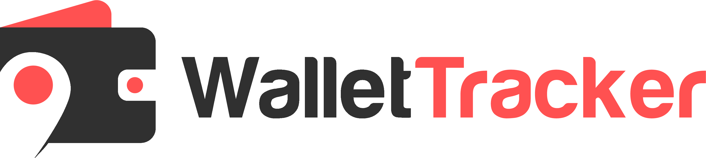

This is a [Next.js](https://nextjs.org/) project bootstrapped with [`create-next-app`](https://github.com/vercel/next.js/tree/canary/packages/create-next-app).

## Getting Started

First, run the development server:

```bash


## TODO

- fix the caching of queries (DELETE)
- add some stats for dashboard for the accounts, for example number of them or the preview
- add a hover state for NAVBAR items etc. ADD ACCOUNT
- when deleting an account, delete all the records linked to that account
```
